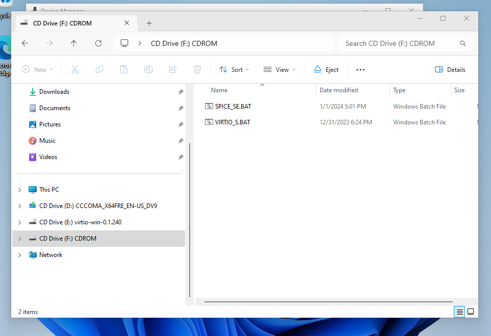

# Windows Post Install Setup

At this point you should have a running windows VM. However, you will need to configure 
windows so that it works correctly with the host machine.

## Install Guest Additions
Some scripts are provided to make guest tool installation easier.
Navigate to the scripts CD drive as shown below.


Run these scripts from an `ADMINISTRATOR` terminal. You don't need to run all the scripts. 
You may also need to run 
```powershell
Set-ExecutionPolicy -ExecutionPolicy Unrestricted
```
Before running the scripts because, by default, Windows will not allow you to run scripts.

### Ez-Install 
There are two scripts that will run the other scripts for you.

- `install-all.ps1` - Runs all the scripts below
- `install-base.bat` - Runs all the scripts under the "Should Install" section

### Should Install 
- `install-package-managers.bat` - Installs `chocolatey` and `scoop` package managers [Required for some other scripts]
- `spice-setup.bat` - Installs the SPICE guest tools. Improves GUI performance 
- `virtiofs-setup.bat` - Installs the VirtIO file system driver. This will allow you to share files between the Linux host and Windows guest.

### Optional
- `dotnet-dev-setup.ps1` - Installs all the tools you will need for dotnet development. Including `vscode` for remote tunneling.

## Switch to local account 
To make the windows VM more durable. You might want to switch to a local account. Using a local account will bypass 
all the silly "Can't use PIN" because of "Security Policy" nonsense. To do this follow these steps.

2. Search for "Your Info" in the start menu
3. Click "Sign in with a local account instead"
4. Follow the prompts to switch to a local account

## Backup Your Disk

Now that you have a working windows VM you should make a backup of the disk. This way you can make many duplicate window VMs
with `win-kvm` while avoiding the long windows install process. I would provided my base disk but I don't think Microsoft would like 
that very much 😛. Backing up your disk is simple. 

1. Shutdown the VM
2. Copy the disk image under `vm/disk/windows.qcow2` to another location.

Now you can setup another windows instance by simply cloning this repo to another location and placing your windows disk in the `vm/disk/` directory of the fresh clone. Then just run `install.sh` as normal. BAM! Another windows VM.
